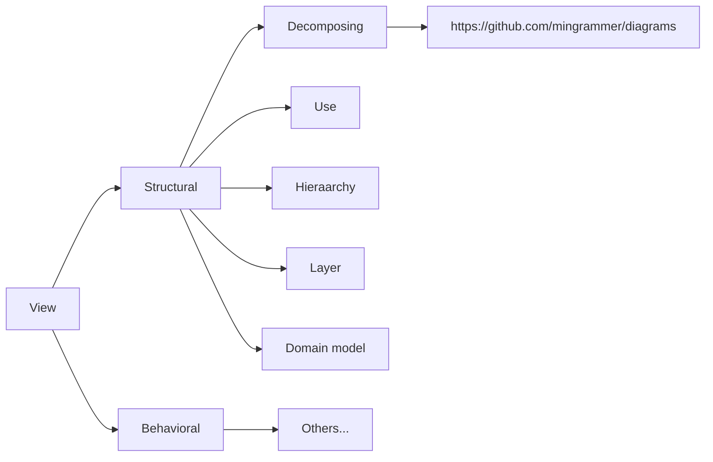

# Distributed System Note

> [TOC]

## Resource aand Service Management (04/19/2021)
- Resource/ Service
    – An entity that is available in limited supply

## Indirect Communication (04/12/2021)
- Event-Driven Architecture
- the publish/subscribe architectural style
- Case study
- MOM Architectural Overview

- Architecture of a CEP + MOM

## TCP/IP, HTTP (03/22/2021)
### Word Wide Web
- 歷史
- 1989由Tim Berners-Lee提出
- 最早主要目的做為學術文件交換
	- 每份文件都可定址 (用於存取的唯一表述格式)
	- 文件內文可透過hyperlink相互參考
- 三大元素
    - 文件定址:URL (Universal Resource Locator)
    - 文件格式:HTML (HyperText Markup Language)
    - 文件傳送:HTTP (HyperText Transfer Protocol)

### Web主要元素
- Resource
    - Provides contents via HTTP
    - Addressable via URL
    - Hosted by a Web server
- Web client and server
    - Client: send requests to a server (URL)
        - May be following a hyperlink
- Server: send responses (includes contents) back to the client

### HTTP
-  Hypertext Transport Protocol
    - Application layer protocol
    - HTTP/1.1, HTTP/2.0, HTTP/3 (QUIC)
    - Based on TCP/IP
- Language of the Web
    - Protocol used for communication between Web clients and servers
- Is stateless (指 server-side) (原則上)
    - Server does not maintain the state of a session
    - Server的負擔較輕
    - 每次交談時，Client要自帶完整前後文
    - Pros 保持多連線狀態
    - Cons 犧牲頻寬

###  Web Services: 二種主要實現方式
SOAP
- 將服務視為遠端函式 RPC
- 依照一定格式將呼叫/回應以XML編碼 (SOAP, Simple Object Access Protocol)
- 只將HTTP拿來做為訊息運送工具
- 使用WSDL(Web Service Description Language)描述服務內容

REST
- 將HTTP視為應用程式平台，將服務視為物件(資源)
- 使用HTTP方法(GET/POST/...)操作資源
- 不限定訊息格式(XML,JSON或其它)
- 有多種方式可用來描述服務
    - Swagger (Open API) 
    - WADL
SOAP 思維 由operation出發, REST 思維由 data 出發
### 

## Networking (03/15/2021)

### Communication network of a distributed system
- Connection: wire, cable, fiber, 無線電
- Device: router, switch, bridges, hubs, repeaters, 網卡
- Software: protocol, drivers, API

### Switching Network
- Circuit switching
- Two nodes establish a dedicated communications channel (circuit)
- 傳統電信網路(POTS, Plain old telephone system)
	- Packet switching
- Packet: basic unit of transmission over network
- Packets are queued in a buffer
	- transmitted when the link is available
	- transmitted over a shared network channel
### From message to packet
- Message
    - Logical data unit of communicating ( endpoints’ view point)
- Packet
    – The physical data unit of network transmission
## Describing Software Systems (03/15/2021)
### Document Behaviors
#### What to document
- Ordering of interactions among the elements
- Opportunities for concurrency
- Possible states of the system
- Usage patterns for different system resources
    - memory, CPU, database connections, or network

#### To reveal
- Stimulus and activity (外來刺激導致的系統行為)
- **Ordering** of interactions (發生時序)
- **Location** of the behavior (發生場域)
    - Elements or relations that the behavior maps to

## Describing Software Systems (03/08/2021)
> - Why and how to describe software systems
> - UML Diagrams
> - Software quality concepts
> [time=Mon, Mar 8, 2021 1:34 PM]

### Why to Describe Software System
> Goal -> Features -> Views -> Diagrams
- 設計工具 (design by writing)
    - 有助更嚴謹思考系統設計
    - 軟體性質分析 (*-ility)
- 溝通橋樑
    - 學術論文中對軟體設計的表述
    - 職場中分享設計技巧或與其它架構設計人員相互學習
    - 訓練新進人員

### 系統設計文件與品質
- 任何設計選擇(design decisions)都決定了部份的品質
    - Client-server: scalability
    - Layer: portability, e.g. TCP/IP, JVM...
    - SOA: interoperability
    - 在文件中記錄了design rationale

### 系統設計文件
- View
    – 用特定「觀點」或用特定「描述風格」（Style）來描述此系統
    – 由此「觀點」、「描述風格」可看出軟體系統的性質
    – 包含圖與文字描述
    
### 如何描述一個軟體系統
- 選擇Views
	-  此views應對整體軟體系統的Quality Attributes有影響
	-  畫圖並以文字論述設計
	    -  動靜態觀點
	-  評估與討論

### Ingredients of Views
- Diagrams 圖
	-  Graphical presentations (Typically UML)
- Descriptions 文
	-  **Explains** and **defines** the elements shown in the view and lists their properties
	-  Possible **extensions**: explain any built-in mechanisms for tailoring the architecture
	-  **Design rationale**
		- Explain the choice/trade-offs of the approach
		- How quality attributes are satisfied using the approach
