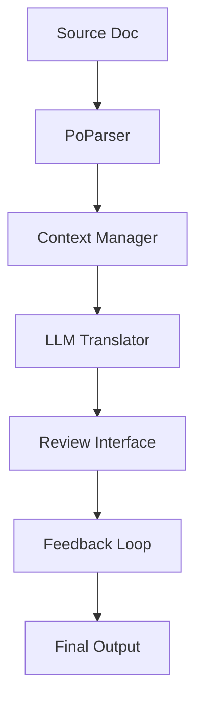

# pollm: Python Official Documentation LLM Translation Assistant
## Leveraging LLMs for Technical Documentation Translation

---

# Why Translation Matters

- Documentation is knowledge transfer
- Builds common vocabulary across languages
- Reduces information asymmetry
- Enables broader community participation
- Strengthens cross-cultural connections

---

# Current Translation Challenges

1. Technical accuracy vs readability
2. Maintaining consistent terminology
3. Time-consuming manual review process
4. Limited translator resources
5. Context understanding requirements

---

# Why LLMs for Translation?

- Strong language understanding capabilities
- Context-aware translations
- Consistent terminology usage 
- Faster initial draft generation
- Can learn from human corrections

---

# Learning from Aider's Success

Aider's key principles we can apply:
1. Leverage existing tools (Git, CST)
2. Focus on specific domain expertise
3. Lightweight integration
4. Clear feedback loops
5. Human-in-the-loop design

---

# pollm Design Goals

1. Assist, not replace, human translators
2. Maintain technical accuracy
3. Ensure consistent terminology
4. Speed up initial translation process
5. Enable easy review/correction workflow

---

# Core Components

1. Translation Engine
   - LLM integration
   - Context management
   - Terminology database

2. Review Interface
   - Diff viewing
   - Comment/correction system

---

# Workflow Design

1. Source doc preprocessing
2. Context gathering (leveraging Aider)
3. Initial LLM translation (leveraging Aider)
4. Human review
5. Feedback incorporation (To be implemented)
6. Final verification

---

# Technical Architecture

---

# Implementation Plan

Phase 1:
- Basic translation pipeline
- Simple review interface

Phase 2:
- Advanced context management (Feedback loop, Terminology DB)
- Terminology consistency
- Feedback incorporation

---

# Success Metrics

1. Translation speed improvement
2. Error reduction rate
3. Reviewer satisfaction
4. Community adoption
5. Documentation coverage

---

# Next Steps

1. Initial prototype development
2. Community feedback gathering
3. Integration with existing tools
4. Pilot testing with small docs
5. Iterative improvement

