# Kafka Architecture Deep Dive

## Core Architecture Components

### Overview
Kafka is a distributed event streaming platform with these key components:
- ZooKeeper/KRaft: Handles cluster coordination and management
- Controller: Manages broker states and partition assignments 
- Broker Cluster: Handles data storage and transmission
- Topics & Partitions: Logical organization of message streams
- Producers & Consumers: Client components for message handling

### Data Flow
- Messages flow unidirectionally: Producer → Broker → Consumer
- Supports multiple concurrent producers and consumers
- Uses partitioning for parallel processing
- Implements replication for reliability
- Uses Leader-Follower model for consistency

### Performance Optimizations
- Zero-copy technology for efficient transmission
- Batch processing to reduce network overhead
- Page caching for optimized read/write performance

## Component Details

### Topics
- Logical message classification unit (similar to database tables)
- Configurable retention period
- Can be split into multiple partitions for parallelism

### Brokers
- Cluster nodes responsible for storage and management
- Each broker can manage multiple partitions
- Handles read/write requests, replication, and failure recovery
- Uses ZooKeeper/KRaft for cluster coordination:
  - Controller election
  - Cluster membership tracking
  - Topic configuration management
- Supports horizontal scaling
- Provides replication for high availability

### Producer/Consumer Architecture
- Producers:
  - Generate and send messages to topics
  - Support sync/async sending
  - Can implement custom partitioning strategies

- Consumers:
  - Read and process messages from topics
  - Can target specific partitions
  - Use Consumer Groups for load balancing

## Implementation Deep Dive

### Consumer Group Mechanics
- Load balancing mechanism for message consumption
- Consumers in same group share topic message processing
- Each partition handled by one consumer per group
- Dynamic consumer scaling with automatic partition reallocation

### Partition Management
- Logical division unit of topics
- Ordered, immutable message sequence
- Messages assigned offset values
- Supports custom partitioning strategies

### Offset Management
- Unique message identifier within partitions
- Consumers track consumption progress via offsets
- Supports multiple reset strategies:
  - earliest: Start from oldest message
  - latest: Start from newest message
  - specific: Start from specified offset

### Message Handling Reliability
- Duplication Scenarios:
  - Consumer crashes before offset commit
  - Network issues during commit
  - Consumer group rebalancing
- Loss Prevention:
  - Producer acks configuration
  - Minimum in-sync replicas
  - Proper replication factor
- Handling Strategies:
  - Idempotent processing
  - Unique message IDs
  - Transaction support
  - Manual offset management

## Architecture Evolution: ZooKeeper to KRaft

### ZooKeeper Integration
- Core coordination service role:
  - Controller election management
  - Cluster state storage
  - Health monitoring
  - Configuration management
- Metadata management:
  - Topic/partition state
  - ISR (In-Sync Replicas) tracking
  - Consumer group coordination

### KRaft Transition (Kafka 3.0+)
- Removing ZooKeeper dependency
- Integrating controller with broker
- Moving metadata storage to brokers
- Benefits:
  - Simplified architecture
  - Improved performance
  - Reduced maintenance overhead

## Implementation Details

### Consumer Message Flow

### Node vs Broker Distinction
- Node:
  - Lightweight network endpoint representation
  - Basic connection information
  - Used primarily for client network operations
  - Represents any network endpoint

- Broker:
  - Full Kafka broker instance
  - Complete broker configuration and state
  - Additional metadata:
    - Broker roles
    - Configuration
    - Multiple endpoints
    - State information

### Metadata Management
- KRaft Mode:
  - Uses controller.quorum.voters configuration
  - No ZooKeeper dependency
  - Controller-based metadata management
  - Future standard

- Legacy Mode:
  - Uses zookeeper.connect configuration
  - ZooKeeper-based metadata management
  - Being phased out

## Best Practices and Considerations

### Consumer Implementation Choices
1. Consumer in Celery Task:
   - Pros:
     - Easy Celery infrastructure integration
     - Built-in retry mechanism
     - Celery ecosystem monitoring/logging
     - Simpler deployment with existing Celery
   - Cons:
     - Celery task queue overhead
     - Less consumer behavior control
     - May not suit high-throughput needs
     - Increased complexity with mixed queuing
     - Partition reading challenges
     - Unexpected worker failure handling

2. Standalone Consumer Service:
   - Pros:
     - Better consumer behavior control
     - Direct Kafka connection
     - Better high-throughput performance
     - Clear concern separation
   - Cons:
     - Custom retry implementation needed
     - Additional service maintenance
     - More complex deployment
     - Independent scaling handling

### Leadership Management
- Selection Process:
  - Initial round-robin distribution
  - Rack awareness consideration
  - Even distribution across brokers
- Eligibility Criteria:
  - ISR list membership
  - Responsiveness
  - Catch-up status
  - Minimum ISR size compliance
- Failure Handling:
  - Health monitoring
  - Failure detection
  - Election initiation
  - Metadata updates

This comprehensive overview covers the key aspects of Kafka's architecture, implementation details, and operational considerations, providing a solid foundation for understanding and working with Kafka systems.

## Spark Integration with Kafka

Apache Spark's integration with Kafka provides powerful distributed stream processing capabilities. This section explores how Spark's Kafka connector manages offsets, calculates partition ranges, and optimizes performance.

### Spark-Kafka Connector Architecture

```mermaid
graph TB
    subgraph "Spark Driver"
        A[KafkaSource/KafkaMicroBatchStream<br/>📊 Query entry point<br/>🔄 Offset management<br/>⏱️ Batch coordination<br/>📈 Progress tracking]
        B[KafkaOffsetReader<br/>📡 Fetch latest/earliest offsets<br/>🕐 Timestamp-based lookup<br/>🔍 Partition discovery<br/>⚡ Admin/Consumer API calls]
        C[KafkaOffsetRangeCalculator<br/>✂️ Range splitting logic<br/>📊 Partition count calculation<br/>⚖️ Load balancing<br/>📍 Preferred location assignment]
    end
    
    subgraph "Spark Executors"
        D[KafkaSourceRDD<br/>🏗️ RDD partition creation<br/>📍 Preferred location assignment<br/>⚙️ Compute method implementation<br/>🔄 Iterator creation]
        E[KafkaDataConsumer<br/>📥 Low-level record fetching<br/>🚨 Data loss detection<br/>📊 Metrics tracking<br/>🔄 Consumer pool management]
    end
    
    subgraph "Kafka Cluster"
        F[Kafka Brokers<br/>📚 Topic partitions<br/>📝 Offset metadata<br/>💾 Message storage<br/>🔄 Replication]
    end
    
    A --> B
    B --> C
    C --> D
    D --> E
    E --> F
    B --> F
    
    style A fill:#e1f5fe
    style B fill:#f3e5f5
    style C fill:#e8f5e8
    style D fill:#fff3e0
    style E fill:#fce4ec
    style F fill:#f1f8e9
```

The architecture consists of:

- **Driver Components**:
  - **KafkaSource/KafkaMicroBatchStream**: The "conductor" orchestrating the process
  - **KafkaOffsetReader**: The "scout" discovering available data
  - **KafkaOffsetRangeCalculator**: The "strategist" deciding how to split work

- **Executor Components**:
  - **KafkaSourceRDD**: The "blueprint" defining how data will be read
  - **KafkaDataConsumer**: The "worker" fetching actual data

- **External System**:
  - **Kafka Cluster**: The data source with topic partitions and messages

### Configuration Parameters Impact

```mermaid
graph TB
    subgraph "Configuration Parameters"
        A[minPartitions<br/>🎯 Minimum Spark partitions<br/>Default: None<br/>Purpose: Ensure parallelism]
        B[maxRecordsPerPartition<br/>📏 Max records per partition<br/>Default: None<br/>Purpose: Memory management]
        C[maxOffsetsPerTrigger<br/>🚦 Rate limiting for streaming<br/>Default: None<br/>Purpose: Batch size control]
        D[failOnDataLoss<br/>⚠️ Error handling behavior<br/>Default: true<br/>Purpose: Data consistency]
    end
    
    subgraph "Impact on Processing"
        E[Partition Count<br/>📊 Number of Spark tasks<br/>🔄 Parallelism level<br/>⚡ Resource utilization]
        F[Memory Usage<br/>💾 Per-partition memory<br/>🗂️ Buffer requirements<br/>🔄 GC pressure]
        G[Throughput<br/>📈 Records per second<br/>⏱️ Latency characteristics<br/>🔄 Backpressure handling]
        H[Fault Tolerance<br/>🛡️ Error recovery<br/>📊 Data loss handling<br/>🔄 Retry behavior]
    end
    
    A --> E
    B --> F
    C --> G
    D --> H
    
    style A fill:#e3f2fd
    style B fill:#e8f5e8
    style C fill:#fff3e0
    style D fill:#ffebee
```

Key configuration parameters include:
- **minPartitions**: Sets minimum worker count for parallelism
- **maxRecordsPerPartition**: Limits worker load to prevent memory issues
- **maxOffsetsPerTrigger**: Controls consumption rate
- **failOnDataLoss**: Determines behavior when data is missing

### Offset Range Calculation Algorithm

Spark's Kafka connector uses a sophisticated algorithm to determine how to distribute Kafka partition data across Spark tasks:

```mermaid
flowchart TD
    A[🎯 Input: Map of TopicPartition → KafkaOffsetRange<br/>📊 Example: orders-0: 1000→151000 150k records<br/>📊 orders-1: 2000→82000 80k records<br/>📊 orders-2: 5000→35000 30k records] --> B[🔍 Filter ranges where size > 0<br/>✅ Valid ranges only<br/>❌ Skip empty ranges]
    
    B --> C{📏 maxRecordsPerPartition set?<br/>🎯 Memory management check<br/>⚖️ Prevent oversized partitions}
    
    C -->|✅ YES| D[✂️ Split ranges exceeding maxRecords<br/>📊 orders-0: 150k > 50k → Split needed<br/>📊 orders-1: 80k > 50k → Split needed<br/>📊 orders-2: 30k < 50k → Keep as-is]
    C -->|❌ NO| E[📦 Keep original ranges<br/>1:1 Kafka → Spark mapping]
    
    D --> F[🧮 Calculate: parts = ceil（size / maxRecords）<br/>📊 orders-0: ceil（150k/50k） = 3 parts<br/>📊 orders-1: ceil（80k/50k） = 2 parts<br/>📊 orders-2: 1 part unchanged]
    
    F --> G[✂️ Apply getDividedPartition method<br/>🔄 Integer division with remainder handling<br/>📊 Ensure equal distribution]
    
    G --> H[🔄 Update ranges with split results<br/>📊 orders-0: 3 ranges （50k, 50k, 50k）<br/>📊 orders-1: 2 ranges （40k, 40k）<br/>📊 orders-2: 1 range （30k）<br/>📊 Total: 6 partitions]
    
    E --> I{🎯 Current partitions < minPartitions?<br/>⚖️ Parallelism requirement check<br/>📊 Target partition count}
    H --> I
    
    I -->|❌ NO| J[✅ Use current partition set<br/>📊 Sufficient parallelism<br/>🎯 Meet requirements]
    I -->|✅ YES| K[📊 Calculate total size and distribution<br/>🧮 Total: 260k records across 6 partitions<br/>🎯 Need: 8 partitions （minPartitions）<br/>📊 Missing: 2 partitions]
    
    K --> L[🔍 Identify partitions to split vs keep<br/>📊 Large partitions: orders-0 ranges （50k each）<br/>📊 Small partitions: orders-2 （30k）<br/>⚖️ Split large, keep small]
    
    L --> M[✂️ Apply proportional splitting<br/>📊 Split largest orders-0 ranges<br/>🔄 Create additional partitions<br/>⚖️ Balance load distribution]
    
    M --> N[🔄 Merge split and unsplit partitions<br/>📊 Final count: 8 partitions<br/>✅ Meet minPartitions requirement]
    
    J --> O[📍 Assign preferred executor locations<br/>🏷️ Hash-based distribution<br/>🔄 Enable consumer reuse<br/>⚡ Optimize performance]
    N --> O
    
    O --> P[🎯 Return final KafkaOffsetRange array<br/>📊 Complete partition specification<br/>📍 Executor assignments<br/>✅ Ready for execution]
    
    style A fill:#e3f2fd
    style D fill:#e8f5e8
    style F fill:#fff3e0
    style K fill:#ffebee
    style P fill:#e8f5e8
```

The algorithm follows these steps:
1. **Input Processing**: Start with Kafka partition offset ranges
2. **Memory Management**: Split large ranges to prevent memory issues
3. **Parallelism Check**: Ensure minimum partition count for parallelism
4. **Additional Splitting**: Further split large partitions if needed
5. **Executor Assignment**: Assign partitions to executors using consistent hashing

### Row Counting and Transaction Handling

Spark's Kafka connector distinguishes between estimated and actual record counts:

```mermaid
graph TB
    subgraph "📊 Estimation Phase (Planning)"
        A[🧮 KafkaOffsetRange.size<br/>📊 = untilOffset - fromOffset<br/>📊 orders-0: 151000-1000 = 150k<br/>🎯 Used for splitting decisions]
        B[⚠️ Assumptions Made<br/>📊 1 offset = 1 record<br/>📊 No transaction metadata<br/>📊 No log compaction<br/>📊 No aborted transactions]
        C[📈 Potential Overestimation<br/>📊 Transaction control records<br/>📊 Aborted messages<br/>📊 Compacted duplicates<br/>📊 Actual < Estimated]
    end
    
    subgraph "🔍 Actual Counting Phase (Execution)"
        D[📥 KafkaDataConsumer.get<br/>🔄 Iterates through actual records<br/>📊 Skips metadata records<br/>📊 Handles isolation levels]
        E[📊 Record Type Filtering<br/>✅ Data records → Count<br/>❌ Control records → Skip<br/>❌ Aborted records → Skip<br/>📊 Track totalRecordsRead]
        F[📈 Actual Count Tracking<br/>📊 totalRecordsRead: Real count<br/>📊 numRecordsPolled: Raw count<br/>📊 numPolls: API calls<br/>📊 Accurate measurement]
    end
    
    A --> B
    B --> C
    D --> E
    E --> F
    
    C --> G[📊 Example Gap<br/>📊 Estimated: 150,000 records<br/>📊 Actual: 147,500 records<br/>📊 Difference: 2,500 （1.7%）]
    F --> H[✅ Accurate Results<br/>📊 Processable records only<br/>📊 Consistent with semantics<br/>📊 Ready for downstream]
    
    style A fill:#e3f2fd
    style D fill:#e8f5e8
    style G fill:#fff3e0
    style H fill:#c8e6c9
```

This two-phase approach:
- Uses **estimated counts** for planning (based on offset ranges)
- Tracks **actual counts** during execution (filtering out control records)
- Handles transaction isolation levels appropriately
- Provides accurate final counts for reporting

### Consumer Pool Management

Spark optimizes Kafka consumer connections through a sophisticated pool management strategy:

```mermaid
graph TB
    subgraph "🏗️ Consumer Pool Architecture"
        subgraph "🖥️ Executor 1"
            A[📥 Consumer Pool<br/>🔄 LRU Cache: 16 consumers<br/>📊 Hit rate: 85%<br/>⏱️ Avg lifetime: 30 min]
            B[📦 orders-0 → Consumer1<br/>🔄 Reused across batches<br/>📊 Connection: Persistent<br/>⏱️ Last used: 2 min ago]
            C[📦 orders-1 → Consumer2<br/>🔄 Sticky assignment<br/>📊 TCP connection: Active<br/>⏱️ Active tasks: 3]
        end
    end
    
    subgraph "📊 Pool Management Benefits"
        I[🎯 Assignment Strategy<br/>📊 Hash-based distribution<br/>🔄 Consistent assignment<br/>⚡ Load balancing]
        J[📈 Performance Impact<br/>📊 Connection overhead: -60%<br/>📊 Throughput increase: +40%<br/>🔄 Latency reduction: -25%]
        K[💾 Memory Management<br/>📊 Pool size: 16 per executor<br/>📊 Memory per consumer: 3MB<br/>🔄 Total overhead: 144MB]
    end
    
    A --> B
    A --> C
    
    style A fill:#e3f2fd
    style I fill:#fce4ec
    style J fill:#c8e6c9
    style K fill:#ffebee
```

Key benefits include:
- **Connection Reuse**: Avoids expensive reconnection overhead
- **Consistent Assignment**: Same consumer handles same partition
- **Performance Improvement**: Reduces connection overhead by 60%
- **Memory Efficiency**: Controlled memory usage per executor

### Data Loss Detection and Handling

Spark's Kafka connector implements robust data loss detection and handling:

```mermaid
sequenceDiagram
    participant RDD as 🎯 KafkaSourceRDD
    participant Consumer as 📥 KafkaDataConsumer
    participant Kafka as 🏪 Kafka Cluster
    participant Config as ⚙️ Configuration
    
    Note over RDD,Kafka: 🔄 Normal Processing Flow
    RDD->>Consumer: 📊 get(offset=1000)
    Consumer->>Kafka: 📡 fetch(offset=1000)
    Kafka-->>Consumer: ✅ Records from offset 1000
    Consumer-->>RDD: 📊 Return records
    
    Note over RDD,Kafka: ⚠️ Data Loss Scenario
    RDD->>Consumer: 📊 get(offset=1000)
    Consumer->>Kafka: 📡 fetch(offset=1000)
    Kafka-->>Consumer: ❌ Error: Offset 1000 not available<br/>📊 Earliest: 1200<br/>📊 Data aged out (200 records lost)
    
    Consumer->>Config: 🔍 Check failOnDataLoss setting
    
    alt 🚨 failOnDataLoss=true
        Config-->>Consumer: ✅ Strict mode enabled
        Consumer->>RDD: 💥 Throw OffsetOutOfRangeException<br/>📊 Lost records: 200<br/>📊 Range: 1000-1199
        RDD->>RDD: 🛑 Query fails immediately<br/>📊 Ensure data consistency<br/>📊 Manual intervention required
    else 🔄 failOnDataLoss=false
        Config-->>Consumer: ⚠️ Tolerant mode enabled
        Consumer->>Consumer: 📝 Log WARNING about data loss<br/>📊 Lost records: 200<br/>📊 Adjusting start offset to 1200
        Consumer->>Kafka: 📡 fetch(offset=1200)
        Kafka-->>Consumer: ✅ Records from offset 1200
        Consumer-->>RDD: 📊 Return records (fewer than expected)<br/>📊 Actual records: 1800<br/>📊 Expected records: 2000
    end
    
    Note over RDD,Kafka: 📊 Metrics Update
    Consumer->>Consumer: 📊 Update metrics<br/>📊 dataLossDetected: true<br/>📊 recordsLost: 200<br/>📊 adjustedStartOffset: 1200
```

Two response strategies are available:
- **Strict Mode** (failOnDataLoss=true): Fails immediately to ensure data integrity
- **Tolerant Mode** (failOnDataLoss=false): Logs warnings and continues processing

### Performance Optimization Strategies

```mermaid
graph TB
    subgraph "📊 Partition Size Analysis"
        A[📏 Partition Size Factors<br/>📊 Record count<br/>💾 Record size<br/>⏱️ Processing time<br/>📊 Memory usage]
        
        B[❌ Too Small Partitions<br/>📊 < 10k records<br/>⏱️ High task overhead<br/>📊 Poor resource utilization<br/>🔄 Excessive coordinator load]
        
        C[❌ Too Large Partitions<br/>📊 > 500k records<br/>💾 Memory pressure<br/>⏱️ Long task duration<br/>🔄 Straggler tasks]
        
        D[✅ Optimal Partitions<br/>📊 50k-200k records<br/>💾 50-200MB memory<br/>⏱️ 1-5 min duration<br/>🔄 Balanced load]
    end
    
    subgraph "🎯 Sizing Recommendations"
        E[📊 Formula: Optimal Size<br/>🧮 Records = Available Memory / （Record Size × 2）<br/>📊 Example: 1GB / （1KB × 2） = 500k records<br/>⚡ Safety factor: 2x for buffers]
        
        F[⚙️ Configuration Tuning<br/>📊 maxRecordsPerPartition: 100k<br/>📊 minPartitions: CPU cores × 2<br/>🔄 Dynamic adjustment based on load]
    end
    
    A --> B
    A --> C
    A --> D
    D --> E
    E --> F
    
    style A fill:#e3f2fd
    style D fill:#c8e6c9
    style E fill:#e8f5e8
```

Best practices for performance optimization include:
- **Optimal Partition Sizing**: 50k-200k records per partition
- **Memory-Based Sizing Formula**: Available Memory / (Record Size × 2)
- **Configuration Guidelines**:
  - maxRecordsPerPartition: 100k
  - minPartitions: CPU cores × 2
  - Dynamic adjustment based on workload

### Best Practices Summary

For production Spark-Kafka integration:

1. **Core Settings**:
   - minPartitions: CPU cores × 2
   - maxRecordsPerPartition: 100k
   - maxOffsetsPerTrigger: 1M
   - failOnDataLoss: true (for critical data)

2. **Performance Tuning**:
   - Target 2-4 tasks per CPU core
   - Partition size: 50-200k records
   - Task duration: 1-5 minutes
   - Enable compression (LZ4)
   - Use Kryo serialization

3. **Monitoring**:
   - Track input rate vs processing rate
   - Monitor batch processing time
   - Watch consumer lag by partition
   - Set alerts for processing delays > 2 minutes
   - Monitor memory usage patterns

This integration leverages Kafka's distributed architecture while adding Spark's powerful processing capabilities, creating a robust system for high-throughput stream processing.
