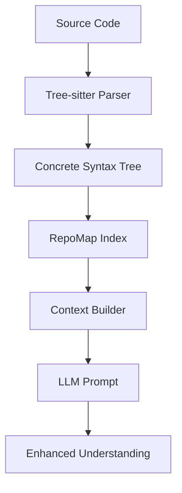

<!-- _class: lead -->
# Aider in Practice
## From Code Understanding to Continuous Integration

---
<!-- _class: default -->
## The Problem: Legacy Code Maintenance

- Engineers spend most time reading & understanding code
- Documentation often outdated or missing
- Complex dependencies and interactions
- High cognitive load for new team members

---
<!-- _class: default -->
## Aider's Core Architecture

1. **RepoMap & CST Integration**
   - Git-based repository indexing
   - Concrete Syntax Tree parsing
   - Precise code retrieval & understanding

2. **Intelligent Prompting**
   - Context-aware diff mode
   - Natural language code editing
   - Structured output generation

---
<!-- _class: default -->
## Code Understanding Deep Dive



---
<!-- _class: default -->
## Development Workflow Integration

1. **Git Integration**
   - Automatic commits
   - Version control awareness
   - Change tracking

2. **IDE & CLI Integration**
   - Language-agnostic
   - No special plugins needed
   - `// code AI!` inline editing
   - `// question AI?` inline queries

---
<!-- _class: default -->
## Documentation Generation

1. **Automated Documentation**
   - Code-based documentation
   - Sequence diagrams
   - Class diagrams
   - Flow charts

2. **Presentation Generation**
   - Marp slides
   - Technical specifications
   - Architecture documents

---
<!-- _class: default -->
## Testing Support

1. **Test Generation**
   - Context-aware test cases
   - Style-matching existing tests
   - Coverage improvement

2. **CI Integration**
   - Automated test updates
   - Style checking
   - Documentation updates

---
<!-- _class: default -->
## Real World Applications

1. **Code Understanding**
   ```python
   # Understanding Airflow internals
   /architect show sequence diagram of OpenAITriggerBatchOperator
   ```

2. **Documentation**
   ```python
   # Generate technical slides
   /architect create marp slides for system architecture
   ```

3. **Testing**
   ```python
   # Add matching tests
   > generate unit tests matching existing style
   ```

---
<!-- _class: default -->
## Best Practices

1. **Do's**
   - Add only relevant files
   - Ask specific questions
   - Verify critical changes
   - Use for code understanding
   - Leverage for documentation

2. **Don'ts**
   - Don't use as search engine
   - Don't trust blindly
   - Don't skip code review
   - Don't ignore context

---
<!-- _class: default -->
## Lessons Learned

1. **Engineers are Thinking Machines**
   - Focus on high-level design
   - Make architectural decisions
   - Review and validate output

2. **Knowledge Management**
   - Structure information
   - Enable efficient retrieval
   - Maintain living documentation

---
<!-- _class: lead -->
## Q&A Discussion Points

1. How has Aider changed your development workflow?
2. What challenges have you faced integrating AI tools?
3. How do you balance automation vs human oversight?
4. What future improvements would you like to see?

---
<!-- _class: default -->
## Resources & References

- [Aider Documentation](https://aider.chat)
- [Installation Guide](https://aider.chat/docs/install.html)
- [Usage Guide](https://aider.chat/docs/usage.html)
- [Best Practices](https://aider.chat/docs/usage/tips.html)
