## Overview

This document provides a comprehensive analysis of how Apache Spark's Kafka connector decides offset ranges for each partition and determines the total number of rows to process. The analysis is based on the source code from the Kafka 0.10+ SQL connector.

## Key Components Architecture

```mermaid
graph TB
    subgraph "Spark Driver"
        A[KafkaSource/KafkaMicroBatchStream<br/>📊 Query entry point<br/>🔄 Offset management<br/>⏱️ Batch coordination<br/>📈 Progress tracking]
        B[KafkaOffsetReader<br/>📡 Fetch latest/earliest offsets<br/>🕐 Timestamp-based lookup<br/>🔍 Partition discovery<br/>⚡ Admin/Consumer API calls]
        C[KafkaOffsetRangeCalculator<br/>✂️ Range splitting logic<br/>📊 Partition count calculation<br/>⚖️ Load balancing<br/>📍 Preferred location assignment]
    end
    
    subgraph "Spark Executors"
        D[KafkaSourceRDD<br/>🏗️ RDD partition creation<br/>📍 Preferred location assignment<br/>⚙️ Compute method implementation<br/>🔄 Iterator creation]
        E[KafkaDataConsumer<br/>📥 Low-level record fetching<br/>🚨 Data loss detection<br/>📊 Metrics tracking<br/>🔄 Consumer pool management]
    end
    
    subgraph "Kafka Cluster"
        F[Kafka Brokers<br/>📚 Topic partitions<br/>📝 Offset metadata<br/>💾 Message storage<br/>🔄 Replication]
    end
    
    A --> B
    B --> C
    C --> D
    D --> E
    E --> F
    B --> F
    
    style A fill:#e1f5fe
    style B fill:#f3e5f5
    style C fill:#e8f5e8
    style D fill:#fff3e0
    style E fill:#fce4ec
    style F fill:#f1f8e9
```

### Architecture Component Explanation

The diagram above illustrates the complete architecture flow of Spark's Kafka offset management system:

**Driver Components (Blue Section):**
- **KafkaSource/KafkaMicroBatchStream**: Acts as the main coordinator that starts queries, manages batch lifecycle, and tracks progress. Think of it as the "conductor" orchestrating the entire process.
- **KafkaOffsetReader**: The "scout" that communicates with Kafka to discover what data is available. It fetches the latest and earliest offsets for each partition and handles timestamp-based queries.
- **KafkaOffsetRangeCalculator**: The "strategist" that decides how to split the work. It takes the available offset ranges and determines how many Spark partitions to create and where to assign them.

**Executor Components (Orange Section):**
- **KafkaSourceRDD**: The "blueprint" that defines how data will be read. It creates the actual partitions that will run on executors and implements the compute logic.
- **KafkaDataConsumer**: The "worker" that does the actual data fetching. It maintains connection pools, handles retries, and processes individual records.

**External System (Green Section):**
- **Kafka Cluster**: The data source containing topic partitions, offset metadata, and the actual messages.

The arrows show the flow: Driver components plan the work, Executors execute it, and both interact with Kafka for different purposes (metadata vs data).

## Configuration Parameters Impact

```mermaid
graph TB
    subgraph "Configuration Parameters"
        A[minPartitions<br/>🎯 Minimum Spark partitions<br/>Default: None<br/>Purpose: Ensure parallelism]
        B[maxRecordsPerPartition<br/>📏 Max records per partition<br/>Default: None<br/>Purpose: Memory management]
        C[maxOffsetsPerTrigger<br/>🚦 Rate limiting for streaming<br/>Default: None<br/>Purpose: Batch size control]
        D[failOnDataLoss<br/>⚠️ Error handling behavior<br/>Default: true<br/>Purpose: Data consistency]
    end
    
    subgraph "Impact on Processing"
        E[Partition Count<br/>📊 Number of Spark tasks<br/>🔄 Parallelism level<br/>⚡ Resource utilization]
        F[Memory Usage<br/>💾 Per-partition memory<br/>🗂️ Buffer requirements<br/>🔄 GC pressure]
        G[Throughput<br/>📈 Records per second<br/>⏱️ Latency characteristics<br/>🔄 Backpressure handling]
        H[Fault Tolerance<br/>🛡️ Error recovery<br/>📊 Data loss handling<br/>🔄 Retry behavior]
    end
    
    A --> E
    B --> F
    C --> G
    D --> H
    
    style A fill:#e3f2fd
    style B fill:#e8f5e8
    style C fill:#fff3e0
    style D fill:#ffebee
```

### Configuration Impact Explanation

This diagram shows how configuration parameters directly affect processing characteristics:

**Configuration Parameters (Left Side):**
- **minPartitions**: Like setting a minimum number of workers for a job. Even if you have small tasks, you want at least this many people working in parallel.
- **maxRecordsPerPartition**: Like setting a maximum weight limit per worker. No single worker should handle more than this many records to prevent exhaustion (memory issues).
- **maxOffsetsPerTrigger**: Like setting a speed limit for streaming jobs. Controls how fast you consume data to prevent overwhelming downstream systems.
- **failOnDataLoss**: Like choosing between "stop everything if there's a problem" vs "log the problem and continue". Critical for data consistency requirements.

**Processing Impact (Right Side):**
Each configuration parameter affects different aspects of performance:
- **Partition Count**: More partitions = more parallelism = faster processing (up to a point)
- **Memory Usage**: Larger partitions = more memory per task = potential out-of-memory errors
- **Throughput**: Rate limiting affects how quickly you can process data
- **Fault Tolerance**: Error handling strategy affects system reliability

## Offset Range Calculation Algorithm

```mermaid
flowchart TD
    A[🎯 Input: Map of TopicPartition → KafkaOffsetRange<br/>📊 Example: orders-0: 1000→151000 150k records<br/>📊 orders-1: 2000→82000 80k records<br/>📊 orders-2: 5000→35000 30k records] --> B[🔍 Filter ranges where size > 0<br/>✅ Valid ranges only<br/>❌ Skip empty ranges]
    
    B --> C{📏 maxRecordsPerPartition set?<br/>🎯 Memory management check<br/>⚖️ Prevent oversized partitions}
    
    C -->|✅ YES| D[✂️ Split ranges exceeding maxRecords<br/>📊 orders-0: 150k > 50k → Split needed<br/>📊 orders-1: 80k > 50k → Split needed<br/>📊 orders-2: 30k < 50k → Keep as-is]
    C -->|❌ NO| E[📦 Keep original ranges<br/>1:1 Kafka → Spark mapping]
    
    D --> F[🧮 Calculate: parts = ceil（size / maxRecords）<br/>📊 orders-0: ceil（150k/50k） = 3 parts<br/>📊 orders-1: ceil（80k/50k） = 2 parts<br/>📊 orders-2: 1 part unchanged]
    
    F --> G[✂️ Apply getDividedPartition method<br/>🔄 Integer division with remainder handling<br/>📊 Ensure equal distribution]
    
    G --> H[🔄 Update ranges with split results<br/>📊 orders-0: 3 ranges （50k, 50k, 50k）<br/>📊 orders-1: 2 ranges （40k, 40k）<br/>📊 orders-2: 1 range （30k）<br/>📊 Total: 6 partitions]
    
    E --> I{🎯 Current partitions < minPartitions?<br/>⚖️ Parallelism requirement check<br/>📊 Target partition count}
    H --> I
    
    I -->|❌ NO| J[✅ Use current partition set<br/>📊 Sufficient parallelism<br/>🎯 Meet requirements]
    I -->|✅ YES| K[📊 Calculate total size and distribution<br/>🧮 Total: 260k records across 6 partitions<br/>🎯 Need: 8 partitions （minPartitions）<br/>📊 Missing: 2 partitions]
    
    K --> L[🔍 Identify partitions to split vs keep<br/>📊 Large partitions: orders-0 ranges （50k each）<br/>📊 Small partitions: orders-2 （30k）<br/>⚖️ Split large, keep small]
    
    L --> M[✂️ Apply proportional splitting<br/>📊 Split largest orders-0 ranges<br/>🔄 Create additional partitions<br/>⚖️ Balance load distribution]
    
    M --> N[🔄 Merge split and unsplit partitions<br/>📊 Final count: 8 partitions<br/>✅ Meet minPartitions requirement]
    
    J --> O[📍 Assign preferred executor locations<br/>🏷️ Hash-based distribution<br/>🔄 Enable consumer reuse<br/>⚡ Optimize performance]
    N --> O
    
    O --> P[🎯 Return final KafkaOffsetRange array<br/>📊 Complete partition specification<br/>📍 Executor assignments<br/>✅ Ready for execution]
    
    style A fill:#e3f2fd
    style D fill:#e8f5e8
    style F fill:#fff3e0
    style K fill:#ffebee
    style P fill:#e8f5e8
```

### Algorithm Flow Explanation

This flowchart illustrates the step-by-step process of how Spark calculates offset ranges:

**Step 1 - Input Processing:**
Imagine you have a pizza delivery business with 3 delivery areas (Kafka partitions). Each area has a different number of orders waiting:
- Area 1 (orders-0): 150,000 orders (from order #1000 to #151000)
- Area 2 (orders-1): 80,000 orders (from order #2000 to #82000)  
- Area 3 (orders-2): 30,000 orders (from order #5000 to #35000)

**Step 2 - Memory Management Check:**
You decide each delivery driver can handle at most 50,000 orders (maxRecordsPerPartition = 50k). This prevents any single driver from being overwhelmed.

**Step 3 - Splitting Oversized Areas:**
- Area 1: 150k orders > 50k limit → Split into 3 drivers (50k + 50k + 50k)
- Area 2: 80k orders > 50k limit → Split into 2 drivers (40k + 40k)
- Area 3: 30k orders < 50k limit → Keep as 1 driver (30k)
- Total: 6 drivers

**Step 4 - Parallelism Check:**
You want at least 8 drivers working (minPartitions = 8) for efficiency, but you only have 6. So you need 2 more drivers.

**Step 5 - Additional Splitting:**
Take the largest remaining chunks (the 50k order areas) and split them further:
- Split one 50k chunk into two 25k chunks
- Split another 50k chunk into two 25k chunks
- Now you have 8 drivers total

**Step 6 - Driver Assignment:**
Assign each driver to a specific delivery truck (executor) using a consistent method (hashing). This ensures the same driver handles the same area consistently, which improves efficiency through route familiarity (consumer reuse).

## Detailed Partition Splitting Example

Let's trace through a complete example with visual representation:

### Initial Kafka State

```mermaid
graph TB
    subgraph "🏪 Kafka Cluster State"
        subgraph "📋 orders topic"
            O1[📦 partition-0<br/>📊 Range: 1000 → 151000<br/>📏 Size: 150,000 records<br/>⏰ Latest: 151000]
            O2[📦 partition-1<br/>📊 Range: 2000 → 82000<br/>📏 Size: 80,000 records<br/>⏰ Latest: 82000]
            O3[📦 partition-2<br/>📊 Range: 5000 → 35000<br/>📏 Size: 30,000 records<br/>⏰ Latest: 35000]
        end
        
        subgraph "💳 payments topic"
            P1[📦 partition-0<br/>📊 Range: 100 → 40100<br/>📏 Size: 40,000 records<br/>⏰ Latest: 40100]
        end
    end
    
    subgraph "⚙️ Configuration"
        C1[🎯 minPartitions = 8<br/>📏 maxRecordsPerPartition = 50,000<br/>🚦 Ensure parallelism & memory limits]
    end
    
    style O1 fill:#ffcdd2
    style O2 fill:#f8bbd9
    style O3 fill:#e1bee7
    style P1 fill:#c8e6c9
```

### Initial State Explanation

Think of this as a warehouse inventory system:
- **orders topic**: Like a large warehouse with 3 sections (partitions)
  - Section 0: Contains 150,000 items (orders) numbered 1000 to 151000
  - Section 1: Contains 80,000 items numbered 2000 to 82000
  - Section 2: Contains 30,000 items numbered 5000 to 35000
- **payments topic**: Like a smaller warehouse with 1 section
  - Section 0: Contains 40,000 payment records numbered 100 to 40100

**Configuration**: We want at least 8 workers (minPartitions) and no worker should handle more than 50,000 items (maxRecordsPerPartition).

### Step 1: Apply maxRecordsPerPartition

```mermaid
graph TB
    subgraph "🔍 Step 1: Check Record Limits"
        A1[📦 orders-0: 150k records<br/>❌ Exceeds 50k limit<br/>✂️ Needs splitting]
        A2[📦 orders-1: 80k records<br/>❌ Exceeds 50k limit<br/>✂️ Needs splitting]
        A3[📦 orders-2: 30k records<br/>✅ Within 50k limit<br/>📦 Keep as-is]
        A4[📦 payments-0: 40k records<br/>✅ Within 50k limit<br/>📦 Keep as-is]
    end
    
    subgraph "✂️ Splitting Logic"
        B1[🧮 orders-0 split calculation<br/>📊 ceil（150k/50k） = 3 parts<br/>📏 50k + 50k + 50k]
        B2[🧮 orders-1 split calculation<br/>📊 ceil（80k/50k） = 2 parts<br/>📏 40k + 40k]
    end
    
    subgraph "📊 Results After Step 1"
        C1[📦 orders-0-0: 1000→51000 📏 50k<br/>📦 orders-0-1: 51000→101000 📏 50k<br/>📦 orders-0-2: 101000→151000 📏 50k]
        C2[📦 orders-1-0: 2000→42000 📏 40k<br/>📦 orders-1-1: 42000→82000 📏 40k]
        C3[📦 orders-2-0: 5000→35000 📏 30k]
        C4[📦 payments-0-0: 100→40100 📏 40k]
        C5[📊 Total: 7 partitions<br/>🎯 Target: 8 partitions<br/>📊 Missing: 1 partition]
    end
    
    A1 --> B1
    A2 --> B2
    B1 --> C1
    B2 --> C2
    A3 --> C3
    A4 --> C4
    
    style A1 fill:#ffcdd2
    style A2 fill:#f8bbd9
    style A3 fill:#c8e6c9
    style A4 fill:#dcedc8
    style C5 fill:#fff3e0
```

### Step 1 Explanation

This is like organizing a large warehouse shipping operation:

**Initial Assessment:**
- **orders-0**: 150k items - too much for one worker (limit: 50k)
- **orders-1**: 80k items - too much for one worker  
- **orders-2**: 30k items - manageable for one worker
- **payments-0**: 40k items - manageable for one worker

**Splitting Strategy:**
- **orders-0**: Divide 150k items into 3 equal chunks of 50k each
  - Worker 1 handles items 1000-51000
  - Worker 2 handles items 51000-101000  
  - Worker 3 handles items 101000-151000
- **orders-1**: Divide 80k items into 2 equal chunks of 40k each
  - Worker 4 handles items 2000-42000
  - Worker 5 handles items 42000-82000

**Result**: We now have 7 workers, but our target is 8 for optimal parallelism.

### Step 2: Apply minPartitions

```mermaid
graph TB
    subgraph "🎯 Step 2: Ensure Minimum Partitions"
        A[📊 Current: 7 partitions<br/>🎯 Required: 8 partitions<br/>📊 Gap: 1 partition needed]
        B[📊 Total records: 300k<br/>📊 Average per partition: 37.5k<br/>⚖️ Load balancing analysis]
    end
    
    subgraph "🔍 Partition Analysis"
        C[📦 orders-0-0: 50k ⭐ Largest<br/>📦 orders-0-1: 50k ⭐ Largest<br/>📦 orders-0-2: 50k ⭐ Largest<br/>📦 orders-1-0: 40k 📊 Medium<br/>📦 orders-1-1: 40k 📊 Medium<br/>📦 orders-2-0: 30k 📊 Small<br/>📦 payments-0-0: 40k 📊 Medium]
    end
    
    subgraph "✂️ Additional Splitting"
        D[🎯 Select orders-0-0 for splitting<br/>📊 Split 50k into 2 parts<br/>📏 25k + 25k distribution]
        E[🧮 New ranges:<br/>📦 orders-0-0a: 1000→26000 📏 25k<br/>📦 orders-0-0b: 26000→51000 📏 25k]
    end
    
    subgraph "✅ Final Result"
        F[📊 Total: 8 partitions<br/>🎯 Meets minPartitions requirement<br/>📏 Balanced load distribution<br/>✅ Ready for execution]
    end
    
    A --> B
    B --> C
    C --> D
    D --> E
    E --> F
    
    style A fill:#e3f2fd
    style D fill:#e8f5e8
    style F fill:#c8e6c9
```

### Step 2 Explanation

This is like adding one more worker to achieve optimal team size:

**Gap Analysis:**
We have 7 workers but need 8 for optimal efficiency. We need to split one more partition.

**Selection Strategy:**
Among all current partitions, we look for the largest ones that can be split without creating too much imbalance:
- Three 50k partitions (orders-0 chunks) are the largest
- Two 40k partitions (orders-1 chunks) are medium
- One 30k partition (orders-2) is smallest
- One 40k partition (payments-0) is medium

**Splitting Decision:**
We choose to split one of the 50k partitions (orders-0-0) because:
1. It's the largest, so splitting it creates the most balanced result
2. Splitting it into 25k + 25k creates two manageable workloads
3. The resulting distribution is more even

**Final Team:**
Now we have 8 workers with loads ranging from 25k to 50k items - much more balanced than the original 30k to 150k range.

### Final Partition Layout

```mermaid
graph TB
    subgraph "🎯 Final Spark Partitions Layout"
        subgraph "🖥️ Executor 1 （Hash: orders-0）"
            E1P1[📦 Partition 0<br/>📊 orders-0: 1000→26000<br/>📏 25,000 records<br/>⏱️ Est. 2.5 min]
            E1P2[📦 Partition 1<br/>📊 orders-0: 26000→51000<br/>📏 25,000 records<br/>⏱️ Est. 2.5 min]
            E1P3[📦 Partition 2<br/>📊 orders-0: 51000→101000<br/>📏 50,000 records<br/>⏱️ Est. 5 min]
        end
        
        subgraph "🖥️ Executor 2 （Hash: orders-1）"
            E2P1[📦 Partition 3<br/>📊 orders-0: 101000→151000<br/>📏 50,000 records<br/>⏱️ Est. 5 min]
            E2P2[📦 Partition 4<br/>📊 orders-1: 2000→42000<br/>📏 40,000 records<br/>⏱️ Est. 4 min]
        end
        
        subgraph "🖥️ Executor 3 （Hash: orders-2） payments-0)"
            E3P1[📦 Partition 5<br/>📊 orders-1: 42000→82000<br/>📏 40,000 records<br/>⏱️ Est. 4 min]
            E3P2[📦 Partition 6<br/>📊 orders-2: 5000→35000<br/>📏 30,000 records<br/>⏱️ Est. 3 min]
            E3P3[📦 Partition 7<br/>📊 payments-0: 100→40100<br/>📏 40,000 records<br/>⏱️ Est. 4 min]
        end
    end
    
    subgraph "📊 Performance Metrics"
        M1[⚖️ Load Balance: Good<br/>📊 Max: 50k, Min: 25k<br/>📊 Ratio: 2:1 （acceptable）]
        M2[🎯 Parallelism: Optimal<br/>📊 8 partitions across 3 executors<br/>⚡ Full resource utilization]
        M3[💾 Memory Usage: Controlled<br/>📊 Max 50k × 1KB = 50MB per partition<br/>🔄 GC pressure minimal]
    end
    
    style E1P1 fill:#ffcdd2
    style E1P2 fill:#f8bbd9
    style E1P3 fill:#e1bee7
    style E2P1 fill:#d1c4e9
    style E2P2 fill:#c5cae9
    style E3P1 fill:#bbdefb
    style E3P2 fill:#b3e5fc
    style E3P3 fill:#b2dfdb
```


### Final Layout Explanation

This diagram shows the final "work assignment" across the computing cluster:

**Executor Assignment (Like Warehouse Locations):**
- **Executor 1**: Gets all orders-0 related partitions (partitions 0, 1, 2)
  - This is like assigning one warehouse to handle all orders from region 0
  - Benefits: Can reuse connections, cache, and local optimizations
  - Workload: 25k + 25k + 50k = 100k records total

- **Executor 2**: Gets remaining orders-0 and some orders-1 (partitions 3, 4)  
  - Mixed assignment but still maintains some locality
  - Workload: 50k + 40k = 90k records total

- **Executor 3**: Gets remaining orders-1, orders-2, and payments-0 (partitions 5, 6, 7)
  - Handles diverse topics but balanced load
  - Workload: 40k + 30k + 40k = 110k records total

**Performance Characteristics:**
- **Load Balance**: 2:1 ratio between largest and smallest partition (50k vs 25k) is acceptable
- **Parallelism**: 8 tasks running simultaneously across 3 executors
- **Memory**: Each partition uses at most 50MB (50k records × 1KB average), well within limits

**Estimated Processing Time:**
- Assumes ~10,000 records per minute processing rate
- Tasks finish between 2.5-5 minutes, creating acceptable skew
- Total job completes in ~5 minutes (limited by the slowest partition)

## Row Counting Mechanisms

### Estimation vs Actual Counting

```mermaid
graph TB
    subgraph "📊 Estimation Phase (Planning)"
        A[🧮 KafkaOffsetRange.size<br/>📊 = untilOffset - fromOffset<br/>📊 orders-0: 151000-1000 = 150k<br/>🎯 Used for splitting decisions]
        B[⚠️ Assumptions Made<br/>📊 1 offset = 1 record<br/>📊 No transaction metadata<br/>📊 No log compaction<br/>📊 No aborted transactions]
        C[📈 Potential Overestimation<br/>📊 Transaction control records<br/>📊 Aborted messages<br/>📊 Compacted duplicates<br/>📊 Actual < Estimated]
    end
    
    subgraph "🔍 Actual Counting Phase (Execution)"
        D[📥 KafkaDataConsumer.get<br/>🔄 Iterates through actual records<br/>📊 Skips metadata records<br/>📊 Handles isolation levels]
        E[📊 Record Type Filtering<br/>✅ Data records → Count<br/>❌ Control records → Skip<br/>❌ Aborted records → Skip<br/>📊 Track totalRecordsRead]
        F[📈 Actual Count Tracking<br/>📊 totalRecordsRead: Real count<br/>📊 numRecordsPolled: Raw count<br/>📊 numPolls: API calls<br/>📊 Accurate measurement]
    end
    
    A --> B
    B --> C
    D --> E
    E --> F
    
    C --> G[📊 Example Gap<br/>📊 Estimated: 150,000 records<br/>📊 Actual: 147,500 records<br/>📊 Difference: 2,500 （1.7%）]
    F --> H[✅ Accurate Results<br/>📊 Processable records only<br/>📊 Consistent with semantics<br/>📊 Ready for downstream]
    
    style A fill:#e3f2fd
    style D fill:#e8f5e8
    style G fill:#fff3e0
    style H fill:#c8e6c9
```

### Row Counting Explanation

This illustrates the difference between "estimated" and "actual" record counts, like the difference between a restaurant's seating capacity and actual customers served:

**Estimation Phase (Planning - Left Side):**
Think of this like a restaurant manager planning for the evening:
- **Offset Range Calculation**: "We have table numbers 1000 to 151000, so we can serve 150,000 customers"
- **Simple Assumption**: "Each table number = one customer"
- **Planning Decisions**: Based on this estimate, assign 3 waiters to handle 50,000 customers each

**Reality Check (Execution - Right Side):**
When the restaurant actually opens:
- **Actual Service**: Some table numbers are reserved but empty (transaction metadata)
- **Filtering**: Some reservations were cancelled (aborted transactions)
- **Real Count**: Only 147,500 customers actually showed up and were served

**Why the Difference?**
1. **Transaction Control Records**: Like reservation system metadata - takes up space but isn't a real customer
2. **Aborted Transactions**: Like cancelled reservations - the table number was used but no customer came
3. **Log Compaction**: Like updating a reservation - the old entry is removed, new one added

**Practical Impact:**
- **Planning**: Use estimates to decide resource allocation (number of waiters/partitions)
- **Execution**: Count actual customers served (records processed)
- **Reporting**: Report actual numbers, not estimates

This two-phase approach allows Spark to make good planning decisions quickly while still providing accurate final counts.

### Transaction Isolation Impact

```mermaid
graph TB
    subgraph "📦 Raw Kafka Records Stream"
        A[📄 Data Record 1<br/>📊 offset: 1000<br/>💾 payload: order_data<br/>✅ Include in count]
        B[🔄 Control Record<br/>📊 offset: 1001<br/>💾 payload: begin_txn<br/>❌ Skip, don't count]
        C[📄 Data Record 2<br/>📊 offset: 1002<br/>💾 payload: order_data<br/>✅ Include in count]
        D[📄 Data Record 3<br/>📊 offset: 1003<br/>💾 payload: order_data<br/>❌ Aborted, don't count]
        E[🔄 Control Record<br/>📊 offset: 1004<br/>💾 payload: abort_txn<br/>❌ Skip, don't count]
        F[📄 Data Record 4<br/>📊 offset: 1005<br/>💾 payload: order_data<br/>✅ Include in count]
    end
    
    subgraph "🔍 Consumer Processing Logic"
        G[📥 KafkaDataConsumer.get<br/>🔄 Process each record<br/>📊 Check record type<br/>📊 Apply isolation level]
        H{📊 Record Type Check<br/>🔍 Data vs Control<br/>📊 Transaction state}
        I[📊 Isolation Level Check<br/>🔍 read_committed level<br/>📊 Transaction status<br/>✅ Committed only]
    end
    
    subgraph "📊 Counting Results"
        J[📊 totalRecordsRead: 3<br/>📊 numRecordsPolled: 6<br/>📊 numPolls: 2<br/>📊 Efficiency: 50%]
        K[📈 Metrics Tracking<br/>📊 Processing rate<br/>📊 Filtering overhead<br/>📊 Consumer efficiency]
    end
    
    A --> G
    B --> G
    C --> G
    D --> G
    E --> G
    F --> G
    
    G --> H
    H --> I
    I --> J
    J --> K
    
    style A fill:#c8e6c9
    style B fill:#ffcdd2
    style C fill:#c8e6c9
    style D fill:#ffcdd2
    style E fill:#ffcdd2
    style F fill:#c8e6c9
    style J fill:#e3f2fd
```

### Transaction Isolation Explanation

This diagram shows how Kafka's transaction system affects record counting, like filtering valid vs invalid items on a production line:

**Raw Kafka Stream (Top Section):**
Imagine a manufacturing conveyor belt with different types of items:
- **Data Records** (Green): Actual products ready for shipping
- **Control Records** (Red): Assembly line control signals, not products
- **Aborted Records** (Red): Defective products that failed quality control

**Processing Logic (Middle Section):**
Like a quality control inspector:
- **KafkaDataConsumer**: The inspector examining each item
- **Record Type Check**: "Is this a product or a control signal?"
- **Isolation Level Check**: "Is this product from a completed batch or a cancelled one?"

**Specific Example Walk-through:**
1. **offset: 1000**: ✅ Valid order data → Count it (totalRecordsRead++)
2. **offset: 1001**: ❌ Transaction begin marker → Skip (just internal bookkeeping)
3. **offset: 1002**: ✅ Valid order data → Count it (totalRecordsRead++)
4. **offset: 1003**: ❌ Order data but transaction was aborted → Skip (defective batch)
5. **offset: 1004**: ❌ Transaction abort marker → Skip (internal bookkeeping)
6. **offset: 1005**: ✅ Valid order data → Count it (totalRecordsRead++)

**Final Results:**
- **totalRecordsRead**: 3 (actual products shipped)
- **numRecordsPolled**: 6 (total items examined)
- **numPolls**: 2 (number of inspection batches)
- **Efficiency**: 50% (3 good products out of 6 items examined)

**Why This Matters:**
- **Accuracy**: You only want to count real business data, not system metadata
- **Consistency**: Ensures that aborted transactions don't affect your analytics
- **Performance**: Helps understand the overhead of transaction processing

## Data Loss Detection and Handling

```mermaid
sequenceDiagram
    participant RDD as 🎯 KafkaSourceRDD
    participant Consumer as 📥 KafkaDataConsumer
    participant Kafka as 🏪 Kafka Cluster
    participant Config as ⚙️ Configuration
    
    Note over RDD,Kafka: 🔄 Normal Processing Flow
    RDD->>Consumer: 📊 get(offset=1000)
    Consumer->>Kafka: 📡 fetch(offset=1000)
    Kafka-->>Consumer: ✅ Records from offset 1000
    Consumer-->>RDD: 📊 Return records
    
    Note over RDD,Kafka: ⚠️ Data Loss Scenario
    RDD->>Consumer: 📊 get(offset=1000)
    Consumer->>Kafka: 📡 fetch(offset=1000)
    Kafka-->>Consumer: ❌ Error: Offset 1000 not available<br/>📊 Earliest: 1200<br/>📊 Data aged out (200 records lost)
    
    Consumer->>Config: 🔍 Check failOnDataLoss setting
    
    alt 🚨 failOnDataLoss=true
        Config-->>Consumer: ✅ Strict mode enabled
        Consumer->>RDD: 💥 Throw OffsetOutOfRangeException<br/>📊 Lost records: 200<br/>📊 Range: 1000-1199
        RDD->>RDD: 🛑 Query fails immediately<br/>📊 Ensure data consistency<br/>📊 Manual intervention required
    else 🔄 failOnDataLoss=false
        Config-->>Consumer: ⚠️ Tolerant mode enabled
        Consumer->>Consumer: 📝 Log WARNING about data loss<br/>📊 Lost records: 200<br/>📊 Adjusting start offset to 1200
        Consumer->>Kafka: 📡 fetch(offset=1200)
        Kafka-->>Consumer: ✅ Records from offset 1200
        Consumer-->>RDD: 📊 Return records (fewer than expected)<br/>📊 Actual records: 1800<br/>📊 Expected records: 2000
    end
    
    Note over RDD,Kafka: 📊 Metrics Update
    Consumer->>Consumer: 📊 Update metrics<br/>📊 dataLossDetected: true<br/>📊 recordsLost: 200<br/>📊 adjustedStartOffset: 1200
```

### Data Loss Detection Explanation

This sequence diagram illustrates how Spark handles data loss scenarios, like dealing with missing pages in a book:

**Normal Flow (Happy Path):**
- **Student (RDD)**: "I need to read from page 1000"
- **Librarian (Consumer)**: "Let me get that book from the library"
- **Library (Kafka)**: "Here's the book starting from page 1000"
- **Result**: Student gets exactly what they requested

**Data Loss Scenario (Problem):**
- **Student (RDD)**: "I need to read from page 1000"
- **Librarian (Consumer)**: "Let me check the library..."
- **Library (Kafka)**: "Sorry, the book only starts from page 1200 now. Pages 1000-1199 were damaged and removed"
- **Problem**: 200 pages (records) are missing

**Two Response Strategies:**

**Strict Mode (failOnDataLoss=true):**
Like a strict academic policy:
- **Policy**: "If any required reading is missing, the assignment fails"
- **Action**: Immediately stop the entire process
- **Benefit**: Ensures complete data integrity
- **Drawback**: May stop processing unnecessarily for minor losses

**Tolerant Mode (failOnDataLoss=false):**
Like a flexible academic policy:
- **Policy**: "Note missing pages but continue with available content"
- **Action**: Log the problem and adjust expectations
- **Benefit**: Processing continues despite minor issues
- **Drawback**: May miss important data

**Practical Business Impact:**
- **Banking System**: Would use strict mode (can't lose transaction records)
- **Analytics Dashboard**: Might use tolerant mode (small gaps acceptable for trends)
- **Real-time Monitoring**: Depends on criticality of the data

**Metrics and Monitoring:**
The system tracks:
- **dataLossDetected**: Boolean flag indicating if any data was lost
- **recordsLost**: Exact count of missing records
- **adjustedStartOffset**: Where processing actually started vs. planned

This allows operators to understand the impact and make informed decisions about data quality.

## Complete Processing Flow with Performance Metrics

```mermaid
graph TB
    subgraph "🎯 Phase 1: Query Planning (Driver)"
        A[📊 KafkaSource.initialOffset<br/>⏱️ Time: 50ms<br/>📊 Memory: 10MB<br/>🔄 API calls: 5]
        B[📡 KafkaOffsetReader.fetchLatestOffsets<br/>⏱️ Time: 200ms<br/>📊 Network: 15 requests<br/>🔄 Partitions discovered: 11]
        C[🧮 KafkaOffsetRangeCalculator.getRanges<br/>⏱️ Time: 30ms<br/>📊 CPU: Light<br/>🔄 Ranges calculated: 8]
    end
    
    subgraph "🏗️ Phase 2: RDD Creation (Driver)"
        D[📦 KafkaSourceRDD.createPartitions<br/>⏱️ Time: 20ms<br/>📊 Memory: 5MB<br/>🔄 Partitions: 8]
        E[📍 Preferred location assignment<br/>⏱️ Time: 10ms<br/>📊 Hash calculations: 8<br/>🔄 Executors: 3]
    end
    
    subgraph "⚡ Phase 3: Task Execution (Executors)"
        F[🖥️ Executor 1: 3 tasks<br/>⏱️ Time: 5 min<br/>📊 Memory: 150MB<br/>🔄 Records: 125k]
        G[🖥️ Executor 2: 2 tasks<br/>⏱️ Time: 4.5 min<br/>📊 Memory: 100MB<br/>🔄 Records: 90k]
        H[🖥️ Executor 3: 3 tasks<br/>⏱️ Time: 4 min<br/>📊 Memory: 110MB<br/>🔄 Records: 110k]
    end
    
    subgraph "📊 Phase 4: Consumer Operations (Executors)"
        I[📥 KafkaDataConsumer operations<br/>⏱️ Avg fetch time: 15ms<br/>📊 Throughput: 10k rec/sec<br/>🔄 Consumer reuse: 85%]
        J[📈 Record processing<br/>⏱️ Processing rate: 8k rec/sec<br/>📊 Filtering overhead: 5%<br/>🔄 Memory efficiency: 90%]
    end
    
    subgraph "🎯 Phase 5: Results Aggregation (Driver)"
        K[📊 Batch completion<br/>⏱️ Total time: 5.5 min<br/>📊 Total records: 325k<br/>🔄 Success rate: 99.5%]
        L[📈 Performance metrics<br/>📊 Throughput: 985 rec/sec<br/>📊 Latency: P99 < 100ms<br/>🔄 Resource utilization: 78%]
    end
    
    A --> B
    B --> C
    C --> D
    D --> E
    E --> F
    E --> G
    E --> H
    F --> I
    G --> I
    H --> I
    I --> J
    J --> K
    K --> L
    
    style A fill:#e3f2fd
    style D fill:#e8f5e8
    style F fill:#fff3e0
    style I fill:#fce4ec
    style K fill:#c8e6c9
```

### Complete Processing Flow Explanation

This diagram shows the end-to-end processing pipeline, like a restaurant operation from menu planning to customer service:

**Phase 1: Query Planning (Driver - Like Restaurant Management):**
- **KafkaSource.initialOffset**: Head manager decides what to serve today
  - Time: 50ms (quick decision)
  - Memory: 10MB (light planning overhead)
  - API calls: 5 (check ingredients availability)

- **KafkaOffsetReader.fetchLatestOffsets**: Check what's available in the kitchen
  - Time: 200ms (inventory check takes longer)
  - Network: 15 requests (call different suppliers)
  - Partitions discovered: 11 (found 11 ingredient sources)

- **KafkaOffsetRangeCalculator.getRanges**: Plan the work distribution
  - Time: 30ms (assign tasks to kitchen stations)
  - CPU: Light (simple calculations)
  - Ranges calculated: 8 (8 cooking stations)

**Phase 2: RDD Creation (Driver - Like Kitchen Setup):**
- **KafkaSourceRDD.createPartitions**: Set up cooking stations
  - Time: 20ms (quick setup)
  - Memory: 5MB (minimal overhead)
  - Partitions: 8 (8 stations ready)

- **Preferred location assignment**: Assign chefs to stations
  - Time: 10ms (quick assignment)
  - Hash calculations: 8 (optimal chef-station pairing)
  - Executors: 3 (3 head chefs managing stations)

**Phase 3: Task Execution (Executors - Like Kitchen Teams):**
- **Executor 1**: Team of 3 cooking stations
  - Time: 5 min (slowest team due to complex dishes)
  - Memory: 150MB (more ingredients stored)
  - Records: 125k (most orders processed)

- **Executor 2**: Team of 2 cooking stations
  - Time: 4.5 min (medium speed)
  - Memory: 100MB (moderate ingredient storage)
  - Records: 90k (moderate order volume)

- **Executor 3**: Team of 3 cooking stations
  - Time: 4 min (fastest team)
  - Memory: 110MB (efficient storage)
  - Records: 110k (balanced workload)

**Phase 4: Consumer Operations (Executors - Like Food Preparation):**
- **KafkaDataConsumer operations**: Actual cooking process
  - Avg fetch time: 15ms (time to get each ingredient)
  - Throughput: 10k rec/sec (dishes prepared per second)
  - Consumer reuse: 85% (efficient ingredient sourcing)

- **Record processing**: Final dish preparation
  - Processing rate: 8k rec/sec (final plating rate)
  - Filtering overhead: 5% (quality control time)
  - Memory efficiency: 90% (minimal waste)

**Phase 5: Results Aggregation (Driver - Like Restaurant Summary):**
- **Batch completion**: End of service summary
  - Total time: 5.5 min (entire service period)
  - Total records: 325k (total dishes served)
  - Success rate: 99.5% (happy customers)

- **Performance metrics**: Management dashboard
  - Throughput: 985 rec/sec (average service rate)
  - Latency: P99 < 100ms (99% of orders under 100ms)
  - Resource utilization: 78% (efficient use of kitchen)

**Key Insights:**
- **Bottleneck**: Phase 3 (task execution) takes the most time (5 min)
- **Efficiency**: High consumer reuse (85%) and memory efficiency (90%)
- **Reliability**: 99.5% success rate indicates robust processing
- **Scalability**: 78% resource utilization leaves room for growth

## Consumer Pool Management Strategy

```mermaid
graph TB
    subgraph "🏗️ Consumer Pool Architecture"
        subgraph "🖥️ Executor 1"
            A[📥 Consumer Pool<br/>🔄 LRU Cache: 16 consumers<br/>📊 Hit rate: 85%<br/>⏱️ Avg lifetime: 30 min]
            B[📦 orders-0 → Consumer1<br/>🔄 Reused across batches<br/>📊 Connection: Persistent<br/>⏱️ Last used: 2 min ago]
            C[📦 orders-1 → Consumer2<br/>🔄 Sticky assignment<br/>📊 TCP connection: Active<br/>⏱️ Active tasks: 3]
        end
        
        subgraph "🖥️ Executor 2"
            D[📥 Consumer Pool<br/>🔄 LRU Cache: 16 consumers<br/>📊 Hit rate: 90%<br/>⏱️ Eviction rate: 2/hour]
            E[📦 payments-0 → Consumer3<br/>🔄 High reuse frequency<br/>📊 Throughput: 12k rec/sec<br/>⏱️ Uptime: 45 min]
            F[📦 orders-2 → Consumer4<br/>🔄 Moderate usage<br/>📊 Fetch size: 1MB<br/>⏱️ Idle time: 5 min]
        end
        
        subgraph "🖥️ Executor 3"
            G[📥 Consumer Pool<br/>🔄 LRU Cache: 16 consumers<br/>📊 Hit rate: 82%<br/>⏱️ Memory usage: 50MB]
            H[📦 inventory-0 → Consumer5<br/>🔄 Low frequency partition<br/>📊 Batch size: 1k records<br/>⏱️ Last active: 10 min]
        end
    end
    
    subgraph "📊 Pool Management Metrics"
        I[🎯 Assignment Strategy<br/>📊 Hash-based distribution<br/>🔄 Consistent assignment<br/>⚡ Load balancing]
        J[📈 Performance Impact<br/>📊 Connection overhead: -60%<br/>📊 Throughput increase: +40%<br/>🔄 Latency reduction: -25%]
        K[💾 Memory Management<br/>📊 Pool size: 16 per executor<br/>📊 Memory per consumer: 3MB<br/>🔄 Total overhead: 144MB]
    end
    
    A --> B
    A --> C
    D --> E
    D --> F
    G --> H
    
    style A fill:#e3f2fd
    style D fill:#e8f5e8
    style G fill:#fff3e0
    style I fill:#fce4ec
    style J fill:#c8e6c9
    style K fill:#ffebee
```

### Consumer Pool Management Explanation

This diagram illustrates how Spark manages Kafka consumer connections, like a restaurant managing specialized cooking stations:

**Consumer Pool Architecture (Like Restaurant Stations):**

**Executor 1 (Like Main Kitchen):**
- **Consumer Pool**: A storage area for 16 specialized cooking tools
  - **LRU Cache**: Keeps the 16 most recently used tools ready
  - **Hit Rate 85%**: 85% of the time, the needed tool is already available
  - **Avg Lifetime 30 min**: Tools stay active for 30 minutes on average

- **Specific Assignments**:
  - **orders-0 → Consumer1**: Dedicated pasta station
    - **Reused across batches**: Same chef handles all pasta orders
    - **Connection: Persistent**: Keeps the pasta machine running
    - **Last used: 2 min ago**: Recently active, ready for next order

  - **orders-1 → Consumer2**: Dedicated pizza station
    - **Sticky assignment**: Same chef always makes pizzas
    - **TCP connection: Active**: Oven stays heated
    - **Active tasks: 3**: Currently making 3 pizzas

**Executor 2 (Like Dessert Kitchen):**
- **Consumer Pool**: Specialized for dessert making
  - **Hit Rate 90%**: Very efficient tool usage
  - **Eviction Rate 2/hour**: Rarely needs to replace tools

- **Specific Assignments**:
  - **payments-0 → Consumer3**: High-volume ice cream station
    - **High reuse frequency**: Constantly making ice cream
    - **Throughput: 12k rec/sec**: Very fast production
    - **Uptime: 45 min**: Running efficiently for 45 minutes

  - **orders-2 → Consumer4**: Moderate-volume cake station
    - **Moderate usage**: Occasional cake orders
    - **Fetch size: 1MB**: Medium-sized batches
    - **Idle time: 5 min**: Waiting for next order

**Executor 3 (Like Specialty Kitchen):**
- **Consumer Pool**: Handles specialty items
  - **Hit Rate 82%**: Good but not perfect efficiency
  - **Memory usage: 50MB**: Moderate resource consumption

- **Specific Assignments**:
  - **inventory-0 → Consumer5**: Low-volume specialty station
    - **Low frequency partition**: Rarely used specialty items
    - **Batch size: 1k records**: Small orders
    - **Last active: 10 min**: Recently used but now idle

**Pool Management Benefits:**

**Assignment Strategy:**
- **Hash-based distribution**: Like assigning chefs to stations based on their specialties
- **Consistent assignment**: Same chef always handles the same type of dish
- **Load balancing**: Evenly distribute work across all kitchens

**Performance Impact:**
- **Connection overhead: -60%**: Less time spent setting up stations
- **Throughput increase: +40%**: More efficient production
- **Latency reduction: -25%**: Faster order fulfillment

**Memory Management:**
- **Pool size: 16 per executor**: Each kitchen has 16 specialized tools
- **Memory per consumer: 3MB**: Each tool uses 3MB of storage
- **Total overhead: 144MB**: Total memory cost across all kitchens

**Real-World Analogy:**
Imagine a restaurant where:
- Instead of setting up a new cooking station for each order, chefs reuse existing stations
- Popular dishes (like orders-0) get dedicated, always-ready stations
- Less popular dishes (like inventory-0) share stations that are set up on demand
- The result is faster service, less waste, and better resource utilization

This consumer pool strategy is crucial for high-performance Kafka processing because establishing new connections is expensive, but reusing existing connections is very fast.

## Performance Optimization Strategies

### Partition Sizing Guidelines


### Partition Sizing Explanation

This diagram explains how to choose the right partition size, like determining the optimal workload for employees:

**Partition Size Factors (Top Center):**
Think of this like managing a call center:
- **Record count**: How many calls each agent handles
- **Record size**: How complex each call is (simple inquiry vs. complex problem)
- **Processing time**: How long each call takes
- **Memory usage**: How much information each agent needs to keep in mind

**Three Scenarios:**

**Too Small Partitions (Red - Left):**
Like having agents handle only 1-2 calls per hour:
- **< 10k records**: Each agent gets very few calls
- **High task overhead**: More time spent getting ready than working
- **Poor resource utilization**: Agents sitting idle most of the time
- **Excessive coordinator load**: Supervisor spends more time assigning work than agents spend working

**Too Large Partitions (Red - Right):**
Like having agents handle 100+ calls per hour:
- **> 500k records**: Each agent overwhelmed with calls
- **Memory pressure**: Agents can't keep track of all the information
- **Long task duration**: Some agents take hours to finish while others wait
- **Straggler tasks**: The whole team waits for the slowest agent

**Optimal Partitions (Green - Center):**
Like having agents handle 20-50 calls per hour:
- **50k-200k records**: Manageable workload per agent
- **50-200MB memory**: Reasonable information to keep track of
- **1-5 min duration**: Predictable completion times
- **Balanced load**: All agents finish around the same time

**Sizing Recommendations:**

**Formula for Optimal Size:**
```
Optimal records per partition = Available Memory / (Record Size × Safety Factor)
Example: 1GB / (1KB × 2) = 500k records maximum
```

Think of this like: "How many phone calls can an agent handle given their workspace (memory) and the complexity of calls (record size)?"

**Configuration Tuning:**
- **maxRecordsPerPartition: 100k**: Cap at 100k records per partition
- **minPartitions: CPU cores × 2**: Ensure at least 2 partitions per CPU core
- **Dynamic adjustment**: Monitor and adjust based on actual performance

**Performance Impact:**
- **Throughput**: More partitions generally mean higher throughput (more agents working)
- **Latency**: Larger partitions mean longer processing time (agents take longer per task)
- **Sweet spot**: Around 100k records balances both concerns

**Troubleshooting Guide:**

**Memory Issues (Red):**
When agents run out of workspace:
- **Reduce maxRecordsPerPartition**: Give each agent fewer calls
- **Increase executor memory**: Give each agent a bigger workspace
- **Enable off-heap storage**: Use external storage for complex cases

**Performance Issues (Yellow):**
When work is too slow:
- **Increase parallelism**: Hire more agents
- **Check consumer reuse**: Ensure agents aren't wasting time on setup
- **Monitor partition skew**: Check if some agents have harder calls than others

**Load Balancing (Green):**
When some agents are overworked:
- **Increase minPartitions**: Spread work across more agents
- **Monitor task duration**: Check if some tasks consistently take longer
- **Check preferred locations**: Ensure agents are assigned to their best-suited work

This approach ensures optimal resource utilization while maintaining predictable performance.

## Monitoring and Troubleshooting

### Key Metrics Dashboard

```mermaid
graph TB
    subgraph "📊 Real-time Metrics"
        A[📈 Throughput Metrics<br/>📊 Records/sec: 50k<br/>📊 Batches/min: 12<br/>📊 Lag: 2.5k records<br/>⏱️ Latency: P99 < 200ms]
        
        B[💾 Resource Utilization<br/>📊 CPU: 75%<br/>📊 Memory: 2.8GB/4GB<br/>📊 Network: 100MB/sec<br/>🔄 Disk I/O: 50MB/sec]
        
        C[🔄 Consumer Metrics<br/>📊 Pool hit rate: 85%<br/>📊 Connection reuse: 90%<br/>📊 Fetch latency: 15ms<br/>📊 Poll frequency: 100/sec]
    end
    
    subgraph "⚠️ Alert Conditions"
        D[🚨 Performance Alerts<br/>📊 Throughput < 30k rec/sec<br/>📊 Latency > 1000ms<br/>📊 Error rate > 1%<br/>🔄 Consumer lag > 10k]
        
        E[💾 Resource Alerts<br/>📊 Memory usage > 90%<br/>📊 GC time > 200ms<br/>📊 CPU usage > 90%<br/>🔄 Disk space < 10GB]
        
        F[🔄 Kafka Alerts<br/>📊 Broker down<br/>📊 Partition offline<br/>📊 Replication lag > 5 min<br/>🔄 Topic deletion]
    end
    
    subgraph "🔧 Troubleshooting Actions"
        G[📊 Scale Out<br/>🔄 Increase executors<br/>📊 Add more partitions<br/>⚡ Boost parallelism<br/>📊 Load balancing]
        
        H[⚙️ Configuration Tuning<br/>📊 Adjust partition size<br/>🔄 Optimize batch size<br/>📊 Tune consumer props<br/>⚡ Memory allocation]
        
        I[🏪 Kafka Optimization<br/>📊 Increase retention<br/>🔄 Partition rebalancing<br/>📊 Broker scaling<br/>⚡ Network tuning]
    end
    
    A --> D
    B --> E
    C --> F
    
    D --> G
    E --> H
    F --> I
    
    style A fill:#e3f2fd
    style B fill:#e8f5e8
    style C fill:#c8e6c9
    style D fill:#ffcdd2
    style E fill:#fff3e0
    style F fill:#fce4ec
    style G fill:#dcedc8
    style H fill:#f3e5f5
    style I fill:#e0f2f1
```

### Monitoring and Troubleshooting Explanation

This diagram shows a comprehensive monitoring system, like a hospital's patient monitoring dashboard:

**Real-time Metrics (Top Section - Like Vital Signs):**

**Throughput Metrics (Blue):**
Like monitoring a patient's heart rate and blood pressure:
- **Records/sec: 50k**: Processing 50,000 records per second (like heart rate)
- **Batches/min: 12**: Completing 12 batches per minute (like breathing rate)
- **Lag: 2.5k records**: 2,500 records behind latest (like blood pressure)
- **Latency: P99 < 200ms**: 99% of requests complete under 200ms (like response time)

**Resource Utilization (Green):**
Like monitoring organ function:
- **CPU: 75%**: Processors working at 75% capacity (like brain activity)
- **Memory: 2.8GB/4GB**: Using 70% of available memory (like blood volume)
- **Network: 100MB/sec**: Data flowing at 100MB per second (like blood flow)
- **Disk I/O: 50MB/sec**: Reading/writing at 50MB per second (like kidney function)

**Consumer Metrics (Light Green):**
Like monitoring specific treatment effectiveness:
- **Pool hit rate: 85%**: Connection reuse working 85% of the time (like medication effectiveness)
- **Connection reuse: 90%**: Avoiding connection overhead 90% of the time (like treatment efficiency)
- **Fetch latency: 15ms**: Taking 15ms to get data (like response time to treatment)
- **Poll frequency: 100/sec**: Checking for new data 100 times per second (like monitoring frequency)

**Alert Conditions (Middle Section - Like Medical Alerts):**

**Performance Alerts (Red):**
Like critical vital signs:
- **Throughput < 30k rec/sec**: System processing too slowly (like low heart rate)
- **Latency > 1000ms**: Responses taking too long (like delayed reflexes)
- **Error rate > 1%**: Too many failures (like high fever)
- **Consumer lag > 10k**: Falling too far behind (like irregular heartbeat)

**Resource Alerts (Yellow):**
Like warning signs:
- **Memory usage > 90%**: Almost out of memory (like dehydration)
- **GC time > 200ms**: Garbage collection taking too long (like slow metabolism)
- **CPU usage > 90%**: Processors overworked (like high stress)
- **Disk space < 10GB**: Running out of storage (like low blood sugar)

**Kafka Alerts (Pink):**
Like external system failures:
- **Broker down**: Data source unavailable (like IV disconnected)
- **Partition offline**: Part of data unavailable (like blocked artery)
- **Replication lag > 5 min**: Backup systems behind (like backup equipment delayed)
- **Topic deletion**: Data source removed (like medication discontinued)

**Troubleshooting Actions (Bottom Section - Like Medical Treatments):**

**Scale Out (Green):**
Like adding more medical staff:
- **Increase executors**: Add more workers (like more nurses)
- **Add more partitions**: Divide work more (like more treatment rooms)
- **Boost parallelism**: Work on more things simultaneously (like parallel treatments)
- **Load balancing**: Distribute work evenly (like even patient distribution)

**Configuration Tuning (Purple):**
Like adjusting medication dosages:
- **Adjust partition size**: Change workload per worker (like treatment intensity)
- **Optimize batch size**: Change how much work per batch (like medication frequency)
- **Tune consumer props**: Adjust connection settings (like IV flow rate)
- **Memory allocation**: Adjust memory usage (like nutritional support)

**Kafka Optimization (Light Blue):**
Like improving hospital infrastructure:
- **Increase retention**: Keep data longer (like longer patient records)
- **Partition rebalancing**: Redistribute data (like patient redistribution)
- **Broker scaling**: Add more data servers (like more hospital wings)
- **Network tuning**: Improve data flow (like better communication systems)

**Monitoring Philosophy:**
1. **Preventive**: Watch metrics before problems occur
2. **Reactive**: Alert when thresholds are exceeded
3. **Corrective**: Take specific actions to fix issues
4. **Continuous**: Monitor the effectiveness of corrections

This comprehensive monitoring approach ensures that both the symptoms (performance metrics) and the causes (resource constraints, external dependencies) are tracked and addressed systematically.

## Best Practices Summary

### Configuration Best Practices

```mermaid
graph TB
    subgraph "🎯 Production Configuration"
        A[⚙️ Core Settings<br/>📊 minPartitions: CPU cores × 2<br/>📊 maxRecordsPerPartition: 100k<br/>📊 maxOffsetsPerTrigger: 1M<br/>🔄 failOnDataLoss: true]
        
        B[🏪 Kafka Consumer Props<br/>📊 fetch.max.bytes: 50MB<br/>📊 max.partition.fetch.bytes: 10MB<br/>📊 session.timeout.ms: 30000<br/>🔄 enable.auto.commit: false]
        
        C[💾 Memory Settings<br/>📊 spark.executor.memory: 4g<br/>📊 spark.executor.memoryFraction: 0.7<br/>📊 spark.sql.adaptive.enabled: true<br/>🔄 spark.sql.adaptive.coalescePartitions: true]
    end
    
    subgraph "📊 Performance Tuning"
        D[🔄 Parallelism Tuning<br/>📊 Target: 2-4 tasks per CPU core<br/>📊 Partition size: 50-200k records<br/>📊 Task duration: 1-5 minutes<br/>⚡ Avoid micro-batching]
        
        E[📈 Throughput Optimization<br/>📊 Batch size: Balance latency vs throughput<br/>📊 Consumer prefetch: 2-5 batches<br/>📊 Compression: Enable LZ4<br/>🔄 Serialization: Use Kryo]
        
        F[🛡️ Reliability Settings<br/>📊 Checkpointing: Every 10 batches<br/>📊 WAL: Enabled for fault tolerance<br/>📊 Retries: 3 with exponential backoff<br/>🔄 Idempotent producers]
    end
    
    subgraph "🔧 Monitoring Setup"
        G[📊 Key Metrics<br/>📊 Input rate vs processing rate<br/>📊 Batch processing time<br/>📊 Consumer lag by partition<br/>🔄 Memory usage patterns]
        
        H[⚠️ Alert Thresholds<br/>📊 Processing delay > 2 minutes<br/>📊 Consumer lag > 100k records<br/>📊 Error rate > 0.1%<br/>🔄 Memory usage > 85%]
        
        I[🎯 Capacity Planning<br/>📊 Peak load: 3x average<br/>📊 Retention: 7 days minimum<br/>📊 Scaling headroom: 50%<br/>🔄 Disaster recovery: 2x regions]
    end
    
    A --> D
    B --> E
    C --> F
    D --> G
    E --> H
    F --> I
    
    style A fill:#e3f2fd
    style D fill:#e8f5e8
    style G fill:#c8e6c9
    style B fill:#fff3e0
    style E fill:#fce4ec
    style H fill:#ffcdd2
    style C fill:#dcedc8
    style F fill:#f3e5f5
    style I fill:#e0f2f1
```

### Best Practices Explanation

This diagram outlines proven configurations and practices, like a comprehensive operations manual:

**Production Configuration (Top Section - Like Basic Operating Procedures):**

**Core Settings (Blue):**
Like fundamental business rules:
- **minPartitions: CPU cores × 2**: Ensure at least 2 tasks per CPU core for optimal parallelism (like having 2 workers per workstation)
- **maxRecordsPerPartition: 100k**: Cap partition size to prevent memory issues (like limiting case load per employee)
- **maxOffsetsPerTrigger: 1M**: Limit batch size for streaming to prevent overwhelming (like limiting orders per hour)
- **failOnDataLoss: true**: Stop processing if data is lost to ensure accuracy (like stopping production if quality checks fail)

**Kafka Consumer Props (Yellow):**
Like supplier relationship settings:
- **fetch.max.bytes: 50MB**: Maximum data to fetch in one request (like maximum order size)
- **max.partition.fetch.bytes: 10MB**: Maximum per-partition fetch (like maximum per-supplier order)
- **session.timeout.ms: 30000**: Connection timeout (like payment terms)
- **enable.auto.commit: false**: Manual transaction control (like manual invoice approval)

**Memory Settings (Green):**
Like resource allocation policies:
- **spark.executor.memory: 4g**: Allocate 4GB per worker (like workspace size per employee)
- **spark.executor.memoryFraction: 0.7**: Use 70% for caching (like 70% of workspace for active work)
- **spark.sql.adaptive.enabled: true**: Enable dynamic optimization (like flexible work arrangements)
- **spark.sql.adaptive.coalescePartitions: true**: Merge small partitions automatically (like combining small tasks)

**Performance Tuning (Middle Section - Like Optimization Guidelines):**

**Parallelism Tuning (Green):**
Like workload distribution strategy:
- **Target: 2-4 tasks per CPU core**: Optimal concurrency (like optimal employee-to-task ratio)
- **Partition size: 50-200k records**: Sweet spot for memory and performance (like optimal project size)
- **Task duration: 1-5 minutes**: Predictable completion times (like standard task duration)
- **Avoid micro-batching**: Don't create too many tiny tasks (like avoiding micro-management)

**Throughput Optimization (Pink):**
Like efficiency improvements:
- **Batch size: Balance latency vs throughput**: Larger batches = higher throughput but more latency (like bulk processing vs. real-time)
- **Consumer prefetch: 2-5 batches**: Keep data ready in advance (like inventory buffers)
- **Compression: Enable LZ4**: Reduce network traffic (like compressed file storage)
- **Serialization: Use Kryo**: Faster object serialization (like efficient data formats)

**Reliability Settings (Purple):**
Like business continuity measures:
- **Checkpointing: Every 10 batches**: Save progress regularly (like regular backups)
- **WAL: Enabled for fault tolerance**: Write-ahead logging (like transaction logs)
- **Retries: 3 with exponential backoff**: Retry failed operations with increasing delays (like escalation procedures)
- **Idempotent producers**: Prevent duplicate processing (like preventing duplicate orders)

**Monitoring Setup (Bottom Section - Like Quality Assurance):**

**Key Metrics (Light Green):**
Like business KPIs:
- **Input rate vs processing rate**: Are we keeping up with demand? (like production vs. orders)
- **Batch processing time**: How long does each batch take? (like cycle time)
- **Consumer lag by partition**: How far behind are we? (like backlog monitoring)
- **Memory usage patterns**: Are we using resources efficiently? (like resource utilization)

**Alert Thresholds (Red):**
Like warning systems:
- **Processing delay > 2 minutes**: System is getting slow (like delivery delays)
- **Consumer lag > 100k records**: Falling significantly behind (like large backlog)
- **Error rate > 0.1%**: Too many failures (like quality issues)
- **Memory usage > 85%**: Running out of resources (like capacity warnings)

**Capacity Planning (Light Blue):**
Like strategic planning:
- **Peak load: 3x average**: Plan for 3x normal load (like holiday season capacity)
- **Retention: 7 days minimum**: Keep data for at least a week (like minimum inventory)
- **Scaling headroom: 50%**: Keep 50% extra capacity (like safety margins)
- **Disaster recovery: 2x regions**: Duplicate infrastructure (like backup facilities)

**Implementation Philosophy:**
1. **Start with proven defaults**: Use battle-tested configurations
2. **Monitor and adjust**: Continuously optimize based on actual metrics
3. **Plan for growth**: Build in capacity for future needs
4. **Prepare for failures**: Implement comprehensive error handling and recovery

These best practices represent years of experience running Kafka-based Spark applications in production environments, providing a solid foundation for reliable, high-performance data processing.